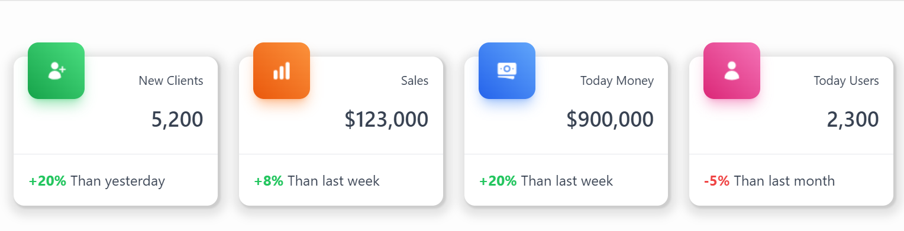

# kebe_dasboard (Template Component Plug-In)
This template component allows you to have an attractive customizable dashboard.

## Installation
Import the file located at plug-in/template_component_plugin_kebe_dashboard.sql
## Demo
Plugin demo [here](https://apex.oracle.com/pls/apex/r/baby_spa/demo-apps)
## Exemple of SQL Query
```sql
SELECT
    'Today Money'     AS TITLE,
    '#ICON_URL1'      AS ICON,
    'blue'            AS HEADER_COLOR,
    '90$'             AS VALUE,
    '+20%'            AS PERCENT,
    'green'           AS PERCENT_COLOR,
    'Than last week'  AS FOOTER
FROM
    DUAL
UNION
SELECT
    'Today Users'     AS TITLE,
    '#ICON_URL2'      AS ICON,
    'pink'            AS HEADER_COLOR,
    '2,300'           AS VALUE,
    '-5%'             AS PERCENT,
    'red'             AS PERCENT_COLOR,
    'Than last month' AS FOOTER
FROM
    DUAL
UNION
SELECT
    'New Clients'     AS TITLE,
    '#ICON_URL3'      AS ICON,
    'green'           AS HEADER_COLOR,
    '5,200'           AS VALUE,
    '+20%'            AS PERCENT,
    'green'           AS PERCENT_COLOR,
    'Than yesterday'  AS FOOTER
FROM
    DUAL
UNION
SELECT
    'Sales'           AS TITLE,
    '#ICON_URL4'      AS ICON,
    'orange'          AS HEADER_COLOR,
    '$123,000'        AS VALUE,
    '+8%'             AS PERCENT,
    'green'           AS PERCENT_COLOR,
    'Than last week'  AS FOOTER
FROM
    DUAL

```
## Attributes
* **TITLE** The title of the element
* **ICON** The value of the element
* **HEADER_COLOR** The background color of the header icon
* **VALUE** The value of the element
* **PERCENT** the percent of the element
* **PERCENT_COLOR** The color of the percent value (For example: red for negative value,green for positive value)
* **FOOTER** The footer description of the value element

